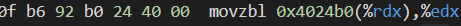

## Bomb Lab

久闻CSAPP的Bomblab，它的名字如雷贯耳。今天（2021/11/1）我抱着尝试的心态打开了这个实验。

#### 经验

我做这个实验花了两天多，因为实在太菜了，phase_6看了大佬们的攻略才懂。大家看看我总结的血泪经验，后面的就别看了，太拙略了。

1. 建议和我一样的萌新在Linux虚拟机上做lab。
2. 直接阅读asm代码固然可以，但还是直接在gdb调试效率更高。
3. 要多去观察寄存器和内存的数据，学会使用 gdb x命令。
4. 坚持下来，刚开始肯定摸不着头脑。拆完两个弹就会发现接下会简单很多。
5. phase_6很难，建议单独拿出来，一鼓作气搞定。

#### 配置环境

刚打开bomb文件夹一定很蒙，为什么给了c文件却不能直接跑？这个实验是将.o文件反汇编后，在gdb中操作的。

我原打算在windows环境下做，结果不方便反编译，遂放弃。

之后看[孟佬](https://zhuanlan.zhihu.com/p/31269514)他的文章，想试试cgdb，配置环境失败，遂放弃，最后使用gdb-tui。

gdbtui 运行界面与debug很像，用一下就慢慢习惯了。

>  Ctrl + N/Ctrl + P 来实现下一条命令和前一条命令

#### phase_1

寄存器esi存储了内存0x402400的值，然后直接就使用了函数。我第一次没有看懂，看了大佬的教程，原来另一个参数rdi已经在调用phase_1时，存入寄存器中。得到返回值eax是否等于零，然后决定炸弹会不会炸。

那么我们拆弹密码就是0x402400存储的值，使用x/s命令将其取出。

#### phase_2

有了经验后我就死磕汇编代码，记了许多注释，但我始终不知道，是怎么样将值存入栈里的。因为没有看懂read_six_number里面的sscanf运行原理。

答案就在0x4025c3里，用x/s打开可看到“%d %d %d %d %d %d” ,这就是传入sscanf的第二个参数，而第一个参数存在rdi中（虽然一直没有出现）。而%rdx存放了%rsi的地址即phase_2中栈顶的地址。%rcx存放了rsi+4,%r8和%r9在rsi+8和rsi+0xc存储第三个和第四个值，第五个和第六个值通过压栈传递。

在观察phase_2，先比(%rsp)==1？je:bomb:；之后将rbx存入rsp+4的地址，rbp存入rsp+24的地址（用于判断循环是否结束）。每次取(%rbx-4)的值乘以2与（%rbx）比较是否相等。

那么数的序列应该为1 2 4 8 16 32

- 小总结：观察每次调用函数传递的参数和比较时的数/给定的内存绝对寻址内容。

#### phase_3

**jmp *0x402470(,%rax,8) means jmp (0x402470(,%rax,8))**.What's more all you need to kown is that the (,%rax,8) means (%rax)*8. 

我因为上面的问题卡了很久,懂了以后查看地址存的值

可以看到要跳转的地址，有很多中可能性，那么只有选某一种可能的值都能拆弹。

有做前面两个的经验，这个炸弹算是很简单的。

#### phase_4

phase_4不算难，要求输入两个数，记为n1,n2。n1首先逆序小于等于14，并作为参数调用func4。

能很简单的看出来，第一调用func4时，若n1==7，便可以两次比较后跳出函数，并且返回值eax==0，顺利拆弹。

当我尝试分析具体的递归过程---有点太复杂了，暂且先放弃。

#### phase_5

找出$rsp+0x18

这四句话时拆这个炸弹的关键，第一条指令将rbx+rax指向的值传一个字节，其实就是将输入字符串依次读取，将字符与0xf做AND，并且存在edx寄存器里。

在0x4024b0读到了，取这句字符串第rdx的字符，并将这个字符存在rsp+10+rax指向地址

> maduiersnfotvbylSo you think you can stop the bomb with ctrl-c, do you?

最后拆弹条件是rsp+10字符串要与0x40245e字符串相同

在0x40245e读到

那么我们只要对照asiic码表，找到flyers在字符串中位置，在推导出应该输入的字符串。

应该有多种可能我去了全部都是小写英文字符，“ionefg”

#### phase_6

仔细读代码，跑gdb，会发现一个双重循环。循环的目的是为了确保输入的六个数两两不同。

之后将输入的数做了7-x处理，再存回去。这些应该都是为了混淆视听吧。

之后是一段很长的代码，也是实现了一个循环的功能。关注到0x6032d0处一个链表，题目会豁然开朗。

可以看到是一个链表结构，前八个字节是数据，后八个字节是地址，指向下一个节点。

接下来循环结构，将链表节点放到了第(7-x)位。

这个数据也是地址，指向了六个数。

不爆炸的条件是前一个节点大于后一个节点，打印出链表数据地址指向的值，为332，168，924，681，477，443将他们排序为升序。期望顺序是3 4 5 6 1 2,则输入应该是4 3 2 1 6 5。

#### 结语

图书馆很温暖，冷色灯光下我开始犯困。但翔安大学不容许我睡着，我只能醒着继续战斗，继续向胡神一点点靠近。

写于2021/11/3~~厦门~~翔安图书馆