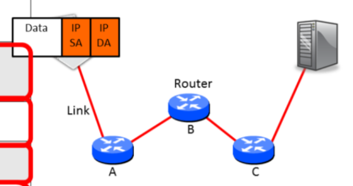
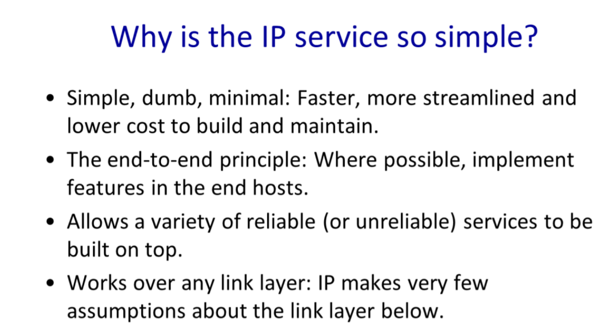
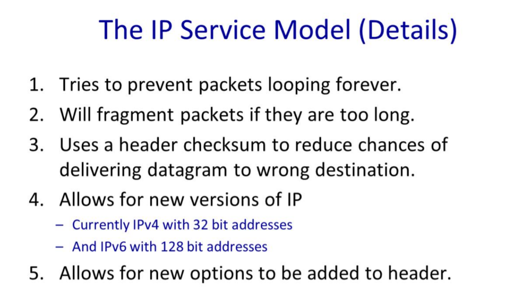
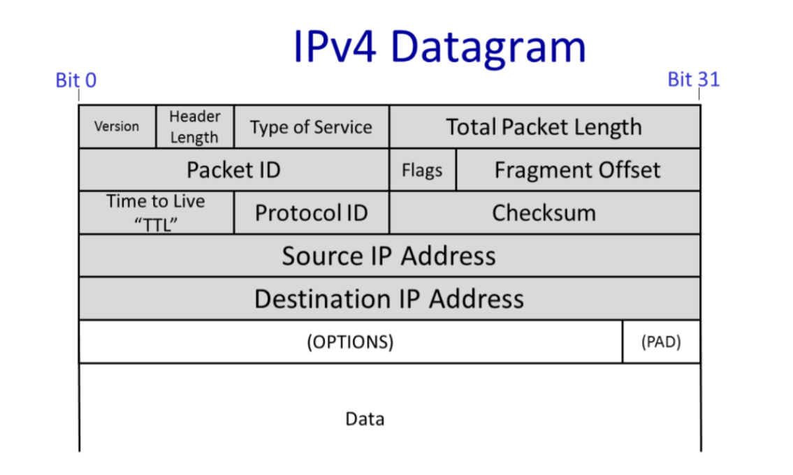

# cs144 lecture

[toc]

# First ：Internet and IP

### 1.A day in the life of an application

- World Wide Web(Http: Hyper Text Transfer Protocol)
- Bit Torrent : peer to peer model 
- Skype

### 2.The four layer of internet model

 - Link: Deliver data over a single link between an end host and router 

 - Network's job is to deliver packets end to end across the Internet from the source to the destination

   ​	Network layer packets are called datagrams(数据包)

   

 - Transport :The most common Transport layer is TCP

   ​	UDP: don't  need reliable delivery

- 

  ​	注意： 各个层常用的协议

- the 7-layer OSI Model

  

### 3.The IP service

| Property       | Behavior                                          |
| -------------- | ------------------------------------------------- |
| Datagram       | individually routed packets. Hop-by-hop routing   |
| Unreliable     | Packets might be dropped                          |
| Best effort    | ... but only if necessary                         |
| Connectionless | No per-flow state. Packets might be mis-sequenced |

- IP creates a datagrams with information in its header ,which contains the IP address of the destination and the IP address of the source (IP DA & IP SA)

- Hop-by-hop through the network from one router to the next .

  Analogy made between how IP datagrams are routed and how letter are routed by the postal service.  

  Neither we know or need to know --- How to transport and where it pass through 

- IP is unreliable but try its best effort to deliver the packet

- Connectionless : When we made a Skype call lasting several minutes , IP layer maintains no knowledge of the call, and simply routes each datagram **individually and independently ** of all the others.

- 

- 

- 

   - The protocol ID: transport protocol 
     The Internet Assigned Numbers Authority (IANA) defines over 140 transport protocol
   - The Version tells us which version of IP - currently, the legal values are IPv4 and IPv6.(This header is  anIPv4 header).
   - "Time to live " prevent packets accidentally looping
   - Total packet length can be up to 64kBytes including the header and all the data
   - Packet ID , Flags and Fragment IP packets into smaller self-contained packets if need-be.
   - The Type of Service field gives a hint to routers about how important this packet is.
   - The Header Length tells us how big the header is -- some headers have optional extra field to carry extra information.
   - checksum is calculated over the whole header so just in case the header is corrupted.

  

